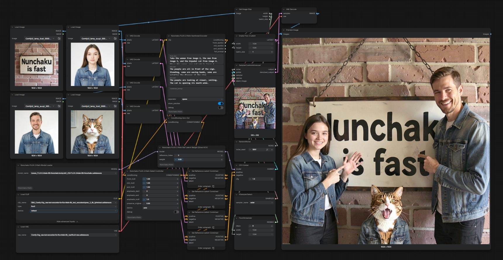

# ComfyUI-Nunchaku-Klein

ComfyUI custom node for **Nunchaku Flux.2 Klein**, independent of official [ComyUI-Nunchaku](https://github.com/nunchaku-ai/nunchaku).
Added features such as **Klein Enhancer** ported + compatibility version to work on Nunchaku (not identical).

> **NOTE**: In order to use "**Direct K/V**" nodes or **Identity Feature Transfer**, you'll have to install the newer fork of Vitoom Nunchaku.

## News
- **2026-08-20** **v1.2.0**
  - **Power LoRA Loader** (Nodes 2.0)
- **2026-08-19**
  - **v1.1.0**
    - **4B Direct K/V callback family**
    - **4B Identity Feature Transfer Final**
  - **v1.0.1**
    - **4B Multi Reference Latent**
    - **4B Mask Ref Controller**
    - **4B Color Anchor**
    - **4B Klein Enhancer**
    - **4B Sectioned Encoder**
    - **4B Detail Controller**
  - **v1.0.0**
    - Added ordinary single- and multi-reference **4B editing support**.
- **2026-08-14**
  - Added strictly profiled **4B basic T2I support** with native Qwen3 4B conditioning.
  - Added profile-aware **4B LoRA support**.
- **2026-08-12**
  - **v0.9.0**
    - **Identity Feature Transfer Final** (`zero_unmasked_tokens` and `Sigma-aware strength scheduling` not supported.) (**Requires new nunchaku backend APIv3**.)
- **2026-08-11**
  - **v0.8.0**
    - **Text/Ref Balance (Direct K/V)** (needs the new modified backend)
  - **v0.7.0**
    - **Ref Latent Weight (Direct K/V)**
      - **NOTE:** NEEDS NEW NUNCHAKU BACKEND. To use this node you'll need to reinstall nunchaku with our **"fork of the community-maintained Nunchaku"** that means, _Vitoom Nunchaku_ which is an extended version of nunchaku by _tonera_ has been **further extended** by me, which gives you **full control over Flux.2 Klein**.
- **2026-08-09**
  - **v0.6.0**
    - **Text/Ref Balance** (not perfect, experimental. Use `0.50-1.00` in `balance`.)
  - **v0.5.0**
    - **Ref Latent Weight**
- **2026-08-08** **v0.4.1**
  - **Multi Reference Latent**
  - **Mask Ref Controller**
  - **Color Anchor**
- **2026-08-06** **v0.3.0**
  - **Sectioned Encoder**
  - **Detail Controller**
- **2026-08-05** **v0.2.0**
  - **Klein Enhancer**
- **2026-08-04**
  - Foundation and basic functionalities for **9B** have been mostly complete.
  - **LoRA** support
  - **Multi-reference editing** support
  - First experimental implementation of **Klein Text Enhancer** node.
    - **NOTE**: Our "Enhancer" nodes **do not work exactly the same as the [original Flux2Klein-Enhancer](https://github.com/capitan01R/ComfyUI-Flux2Klein-Enhancer)**, but the behavior is close. Still experimental.
  - **4B was not supported in this release**.

**Observed**: repeated Nunchaku FLUX.2 Klein executions can produce materially different outputs despite identical workflow inputs and seed. This also reproduces in plain T2I without references, Ref Latent Weight, or LoRA, so it is not specific to those target features.

## Todos:

- [x] 9B basic support
- [x] LoRA support
- [x] Reference Edit support
- [x] Klein Enhancer
- [x] Differential Diffusion (Flux.2-Klein is just not good with this by default.)
- [x] 4B basic T2I support
- [x] 4B LoRA support
- [x] 4B ordinary reference/edit support
- [x] 4B Enhancers (partially)
- [x] Nunchaku Power LoRA Loader
- [ ] SpotEdit
- [ ] ~~Normalized Attention Guidance~~

## Installation

### Basic Usage

1. **First you need to install [tonera's fork of nunchaku (Vitoom Nunchaku)](https://huggingface.co/tonera/vitoom-nunchaku)**. Choose the pre-built wheel matching your setup from their repository.
2. Clone this repository.
3. Download tonera's Nunchaku Klein model from their repository if you don't have one.

### Direct K/V

If you want to use Ref Latent Weight (Direct K/V), Text/Ref Balance (Direct K/V),
Ref Latent Controller (Direct K/V), or Identity Feature Transfer:

Either:
- Install [my "fork of the fork" of nunchaku](https://github.com/tom-m-2020/vitoom-nunchaku-extended).
- Use "repack" script in the repo to your chosen pre-built wheel (**if the version exactly match**.)
  - If you use the repack script, they MUST match the exact variant of pre-built _Vitoom Nunchaku_ wheel as the source e.g.:
    - If you have `nunchaku-1.3.0.dev20260629+cu13.0torch2.11-cp313-cp313-win_amd64`, you must use the script that targets `nunchaku-1.3.0.dev20260629+cu13.0torch2.11-cp313-cp313-win_amd64`.

#### Currently supported wheels

Only a limited number of versions are supported now.

- `nunchaku-1.3.0.dev20260629+cu13.0torch2.11-cp313-cp313-win_amd64`

(Basic usage supports all the other versions, too.)

### Environment

**Tested with**:
- **ComfyUI >=0.29**. Older versions may not work.
- **Python 3.13**
- **Torch 2.11**
- **CUDA 13.0**

## Power LoRA Loader

`Nunchaku FLUX.2 Klein Power LoRA Loader` adds an ordered set of Klein LoRAs
to one model branch. Rows support add, select, signed strength, enable/disable,
remove, and up/down reordering. Zero-strength rows add nothing.
Each row's LoRA field opens a searchable picker. Search is case-insensitive and
matches substrings anywhere in the full LoRA path. `+ Add LoRA` opens the same
picker and creates a new enabled row at strength `1.0` only after selection;
Escape or outside-click adds nothing.

This is an aggregation UI over the ordinary loader contract. It preserves
inherited LoRAs and publishes the same immutable ordered specification tuple as
chaining `Nunchaku FLUX.2 Klein LoRA Loader` nodes. Execution-time composition,
branch switching, accounting, caching, and rollback remain shared.

Parsed canonical LoRAs are held in a small node-local LRU: one entry for the
ordinary loader (matching its previous behavior) and four entries for the Power
loader. Published model branches retain their own referenced LoRA states, so LRU
eviction does not invalidate an existing branch.

Nodes 2.0 is the primary frontend. The row editor registers `rows` as one
custom widget and uses ComfyUI's `WEB_DIRECTORY`, `getCustomWidgets`, and
`addDOMWidget` APIs; the widget's value is the serialized backend input. No raw
JSON or helper LoRA-name widget is rendered. This was tested with ComfyUI 0.29.0
and frontend package 1.47.10. rgthree is not a runtime dependency.

## Enhancer

### What works with Vitoom Nunchaku

- **4B/9B**
  - Multi Reference Latent
  - Mask Ref Controller
  - Color Anchor
  - Klein Enhancer
  - Sectioned Encoder
  - Detail Controller
- **9B only**
  - Klein Text Enhancer
  - Ref Latent Weight (Compatibility ver)
  - Text/Ref Balance (Compatibility ver)
  - Identity Guidance

### What does NOT work without our callback derivative (fork of Vitoom Nunchaku)

- **4B/9B**
  - Ref Latent Weight (Direct K/V)
  - Text/Ref Balance (Direct K/V)
  - Ref Latent Controller (Direct K/V)
  - Identity Feature Transfer Final

## Related Projects
This project involves/is related to several third-party projects

- [ComfyUI](https://github.com/Comfy-Org/ComfyUI)
- [Official Nunchaku](https://github.com/nunchaku-ai/nunchaku)
- [Community-fork of Nunchaku backend](https://huggingface.co/tonera/vitoom-nunchaku)
- [ComfyUI-Flux2Klein-Enhancer](https://github.com/capitan01R/ComfyUI-Flux2Klein-Enhancer)

## License
GPL-3.0-or-later
